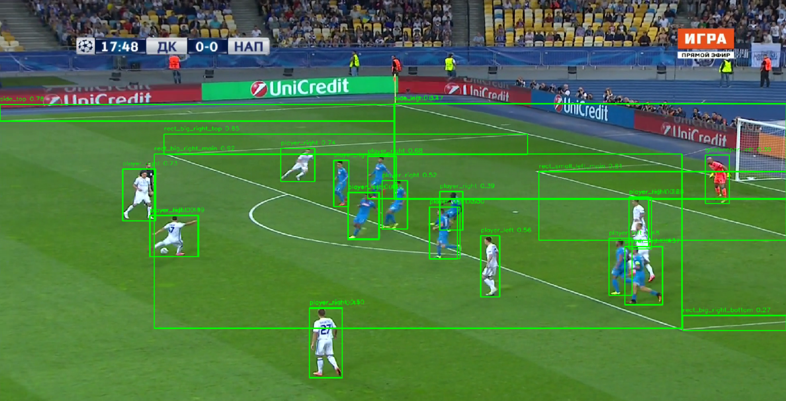
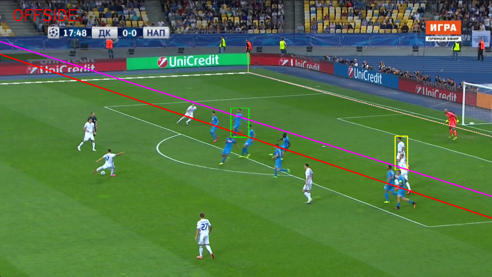

# ⚽ VARLite: Offside Detection from Single-Camera Football Footage

VARLite is an interactive offside detection pipeline for single-camera football broadcasts, built on top of YOLOv8n and enhanced with vanishing-point geometry, HSV-based color clustering for team identification, and real-time image processing.

 <!-- You can add a sample output GIF/screenshot here -->

---

## 📌 Features

* ✅ **YOLOv8n-powered detection** of players and pitch lines
* ✅ **Single-frame inference** (no need for video tracking or stereo)
* ✅ **Vanishing point estimation** via SVD on field lines
* ✅ **Dynamic offside line construction** based on perspective geometry
* ✅ **Interactive team assignment** using color-based HSV clustering
* ✅ **Human-in-the-loop UI** for robustness against misclassification

---

## 📁 Project Structure

```
.
├── Code.ipynb                # Final offside detection notebook
├── runs/                     # YOLO training outputs
├── model_weights.pt          # Final trained YOLOv8n model (you must export this)
├── Labels-v3.json            # SoccerNet-v3 annotated dataset (if used for testing)
├── demo/                     # Optional demo images or output visuals
└── README.md                 # This file
```

---

## 🧠 Methodology

1. **Detection**: Players, goalkeepers, and field lines are detected using a YOLOv8n model fine-tuned on SoccerNet-v3 annotations.
2. **Line Parsing**: Field boundaries (side lines, goal box, etc.) are parsed and their endpoints extracted from bounding boxes.
3. **Vanishing Point Geometry**: SVD is used on vertical field lines to compute the image vanishing point.
4. **Player Selection**: The user clicks on one `player_left` and one `player_right` to seed team classification via HSV histogram similarity.
5. **Clustering**: Overlapping detections are merged via IoU-based NMS, keeping the highest-confidence per cluster.
6. **Offside Logic**: Based on the touch-line direction, the defender and attacker closest to the goal are selected and their projected offside lines drawn via vanishing point projection.

---

## 🧪 Installation

### ⚙️ Requirements

* Python 3.8+
* OpenCV
* Ultralytics (YOLOv8)
* NumPy

### 🔧 Setup

```bash
git clone https://github.com/yourusername/varlite-offside.git
cd varlite-offside

# Install dependencies
pip install -r requirements.txt
```

Contents of `requirements.txt`:

```
ultralytics
opencv-python
numpy
```

---

## 🚀 Usage

### 1. Run Offside Detection

Make sure your image is named (e.g. `4.png`) and located in the root folder.

```bash
python main.py
```

You will be prompted to click on one player from each team (left/right) in an interactive window. The final offside decision and overlays will be shown.

---

## 📊 Training Details

* **Base Model**: `yolov8n.pt` (YOLOv8 Nano from Ultralytics)
* **Dataset**: SoccerNet-v3 annotations (custom split)
* **Classes**: 16 (player\_left, player\_right, goalkeepers, sideline, goal box, etc.)
* **Epochs**: 50
* **mAP50**: 87.1%
* **Hardware**: Trained on a GTX 1650 (4GB VRAM)

---

## 🖼️ Sample Output





---

## 📚 References

* [Ultralytics YOLOv8](https://github.com/ultralytics/ultralytics)
* [SoccerNet-v3 Dataset](https://www.soccer-net.org/)
* OpenCV Docs on [Histogram Comparison](https://docs.opencv.org/4.x/d8/dc8/tutorial_histogram_comparison.html)

---

## 🙋‍♂️ Acknowledgements

* Special thanks to the SoccerNet creators for the dataset
* Ultralytics team for YOLOv8
* UB CSE573: Computer Vision Project Guidance

---

## 🏁 Future Work

* Frame-to-frame tracking (Kalman/DeepSORT)
* Fully automated team classification (remove human clicks)
* Deployable Flask web interface
* Offside detection in full-match videos (not just frames)
